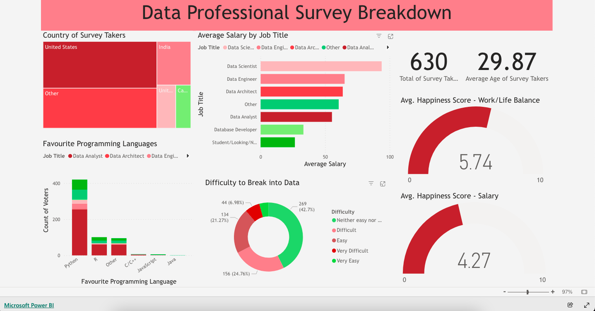

# DataProfessionalSurveyBreakdown

## Table of Contents
- [Business Problem](#business-problem)
  * [Objective](#objective)
  * [Goal](#goal)
- [Data Source](#data-source)
- [Tableau Viz link](#tableau-viz-link)
  * [Preview: PowerBI Dashboard](#preview-powerbi-dashboard)
- [Methods](#methods)
- [Tech Stack](#tech-stack)

## Business Problem
### Objective 
### Goal

## Data Source
- [Github data source containing Data Professional Survey dataset](https://github.com/AlexTheAnalyst/Power-BI/blob/main/Power%20BI%20-%20Final%20Project.xlsx)

## Tableau Viz link
- [Link to my dynamic PowerBI visualization dashboard](https://app.powerbi.com/view?r=eyJrIjoiZjA3OWZhYmYtYTdjYS00NmZhLTkwODAtY2FjNmEyY2EyZTE4IiwidCI6ImZkNjYyMzZhLWE2ZTAtNGJhOC1hMzFjLTA4MjQ3MzYwNDU3MyJ9)

### Preview: PowerBI Dashboard

